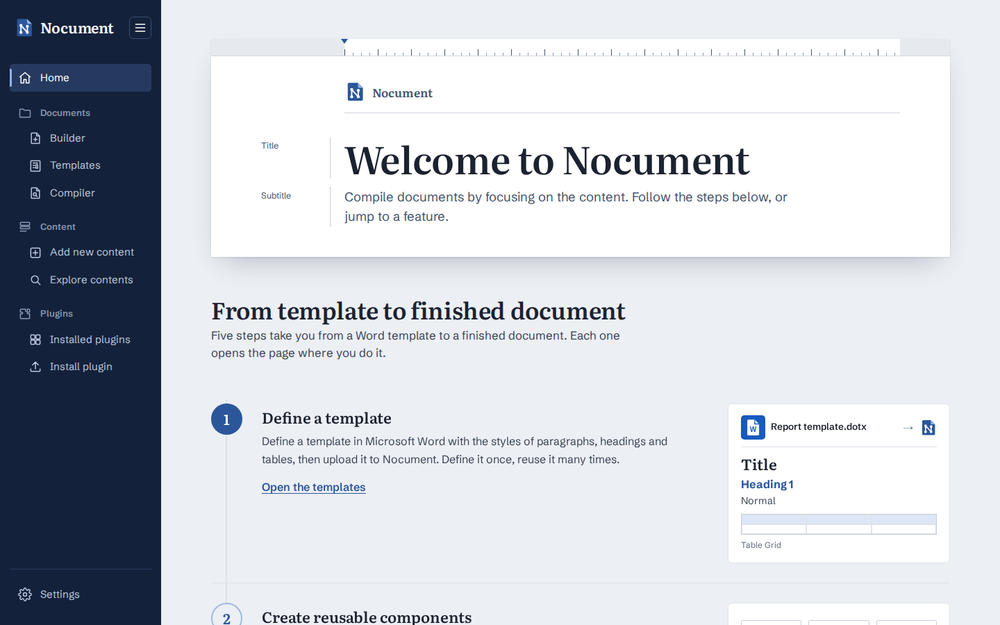
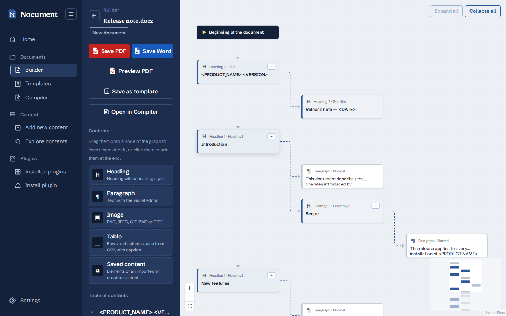

#  Nocument

Nocument makes writing Word documents easier by moving the focus to the **content** instead of manual work in Word.

Define a Word template once, build documents from it with reusable content blocks, fill in keywords such as `<VERSION>` or `<DATE>` and export the result as PDF or Word. The web app (Flask + Svelte) is available in English and Italian.



## Installation

With Docker (web app, LibreOffice and MongoDB):

```bash
cp .env.example .env    # optional: uncomment the variables to change
docker compose up -d --build
```

Open `http://localhost:8080`. The web app has no authentication: on a server reachable by others, set `NOCUMENT_PLUGIN_UPLOAD=false`.

To run it on the host (Python 3.10+, Node.js 20.19+, and LibreOffice or Microsoft Word), see [Installation](docs/wiki/Installation.md). All the options are listed in [Configuration](docs/wiki/Configuration.md).

## Features

- **[Compiler](docs/wiki/Compiler.md)**: fills in the keywords of a Word document (`<NAME>`) with text, images or tables, with a live PDF preview.
- **[Builder](docs/wiki/Builder.md)**: edits a document as a graph of its contents, where you insert, move and edit headings, paragraphs, images and tables.
- **[Templates](docs/wiki/Templates.md)**: documents to start from, saved from the Builder or imported from Word.
- **[Content blocks](docs/wiki/Content-Blocks.md)**: reusable groups of contents, written on an A4 sheet or imported from Word.
- **[Plugins](docs/wiki/Plugins.md)**: plugins bring **external data** (databases, APIs, files...) into the documents. A plugin creates contents (headings, paragraphs, images and tables), which the Builder, the content blocks and the Compiler insert like the ones written by hand. See the wiki for [using and installing](docs/wiki/Plugins.md) and [writing](docs/wiki/Writing-Plugins.md) plugins.
- **[Settings](docs/wiki/Settings.md)**: language, light and dark mode with custom themes, the PDF renderer, the version and the environment variables.

| | | |
| :-: | :-: | :-: |
| [](docs/screenshots/compiler.png)<br>Compiler | [](docs/screenshots/builder.png)<br>Builder | [](docs/screenshots/templates.png)<br>Templates |
| [](docs/screenshots/add-content.png)<br>Content editing | [](docs/screenshots/explore-contents.png)<br>Explore contents | [](docs/screenshots/plugin-page.png)<br>Plugin page |
| [](docs/screenshots/plugins.png)<br>Installed plugins | [](docs/screenshots/install-plugin.png)<br>Install plugin | [](docs/screenshots/settings.png)<br>Settings |

## Development

```bash
python3 -m venv .venv && .venv/bin/pip install -r requirements.txt   # once, on the host
docker compose -f compose.dev.yaml up --build                        # http://localhost:5173, auto-reload
```

Without Docker, run `python -m src.app` and `cd web && npm run dev` in two terminals (on Windows, `run-dev.bat`). Before committing, run `python scripts/check_locales.py` to check the translations.

The developer documentation is in the [wiki](docs/wiki/Home.md): the project structure, the pages and the API, how to write plugins, and more.
