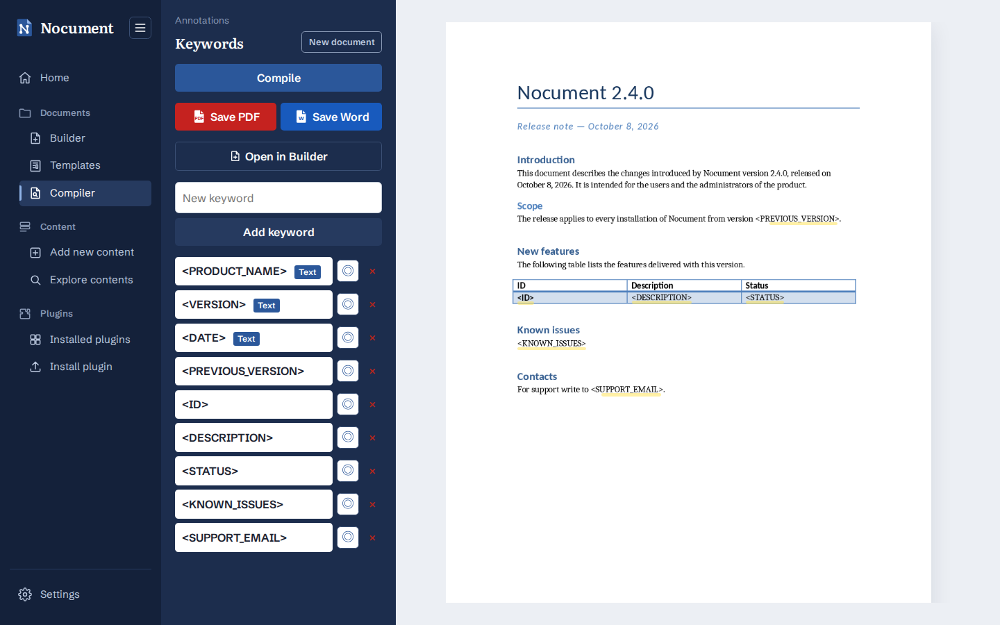

# Compiler

1. Open **Documents → Compiler** (`/documents/compiler`; the old `/documents/analyzer` is redirected) and upload a `.docx`, choosing it with the button or dropping it on the page: the PDF preview is shown.
2. On upload the backend analyzes the document: keywords in the `<NAME>` format are added to the list in the sidebar. Others can be added by hand by typing them in the field and clicking **Add keyword**. The ◎ button goes to the next occurrence in the PDF.
3. Click a keyword and choose the content to insert instead of it. The modal uses the **same editors as the Builder and the content blocks** (visual editor, image editor, table grid) and, at the top, **From plugin**: the installed plugins that create paragraphs fill the text, those that create images the image and those that create tables the grid, which can still be changed before saving:
   - **Text**: replaces the keyword keeping its formatting; it is written in the visual editor, so it can have bold, italic and the like and **hyperlinks** (its paragraphs become line breaks in the keyword's paragraph). Without formatting it is sent as plain text, as before;
   - **Image**: PNG, JPEG, GIF, BMP or TIFF, with an optional width in cm (without it, the native size reduced to the page width); the alignment is the one of the keyword's paragraph;
   - **Table**: the keyword must be in a cell; its row is the template, filled with the first entered row and duplicated for the next ones. If the keyword is in a table, the grid offers the same number of columns.

     The grid is the Builder's one (`TableEditor`, with cells that can have formatting and links), with resizable columns. With **Import CSV** the grid is filled from a `.csv` file (separator `,` `;` tab or `|`, encoding UTF-8 or Windows-1252); if the first row contains the headers it becomes the column names. Each column has a checkbox to keep or exclude it (with **Select all** / **Deselect all** to act on all of them) and the ←/→ arrows to move it; each row has ↑/↓ to move it and × to delete it. Clicking a column name sorts it ascending, descending or removes the sorting; several columns can be sorted together (e.g. ID then Name), with priority in the order of the clicks. Numbers are compared as numbers (9 before 10) and case insensitively. With an active sort, moving rows by hand is disabled; removing it restores the previous order. Sorting happens only in the frontend: `/api/compile` receives the rows already sorted. Columns are widened or narrowed by dragging the right border of the header (or with the ←/→ arrows on the border; double-click to reset). With **Apply the column proportions to the document table** (turned on at the first resize) the same proportions are applied to the Word table, keeping its total width; the option is only available if the selected columns match the cells of the keyword's row. A warning appears if the selected columns do not match those of the document table. Reopening the keyword brings back the excluded columns too.

   Keywords with an assigned content show its type next to the name.
4. The preview follows the contents: saving or removing the content of a keyword compiles the document at once and shows the resulting PDF (unlike the Builder, where the PDF is made only when asked). **Compile** runs it again by hand. Keywords without content stay unchanged.
5. **Save PDF** and **Save Word** download the compiled document; before compiling they download the PDF preview and the uploaded `.docx`.
6. The session (document, keywords, assigned contents, last compiled PDF and Word, sidebar width) is saved in the browser in IndexedDB at every change and restored when the page is reloaded. **New document**, at the top of the sidebar, asks for confirmation, clears the session and goes back to the upload screen. Contents not yet saved in a keyword's modal are not part of the session.

> In the backend the search is case sensitive: a keyword added by hand must be written exactly as in the document.

The Compiler draws the PDF with pdf.js 6, which uses JavaScript methods missing in browsers released before 2026 (`Map.prototype.getOrInsertComputed`, `Math.sumPrecise`): `web/src/pdfPolyfills.js` adds them in the page and in the pdf.js worker (`web/src/pdfWorker.js`), so older browsers (e.g. Firefox ESR) can open documents too.
