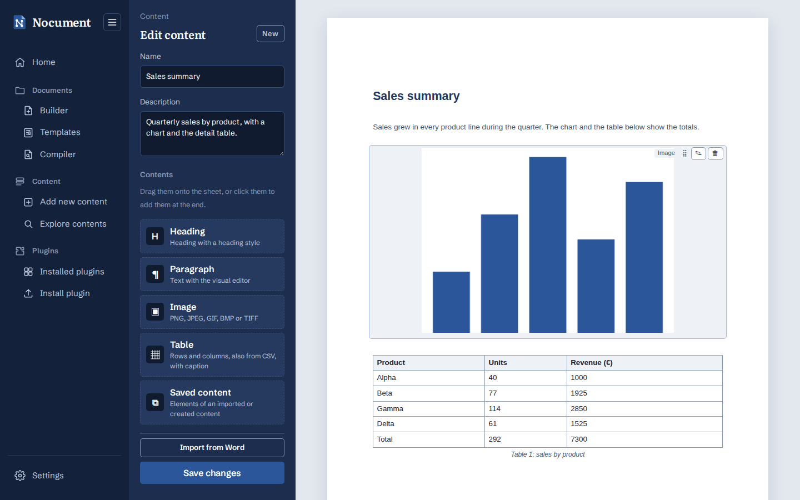
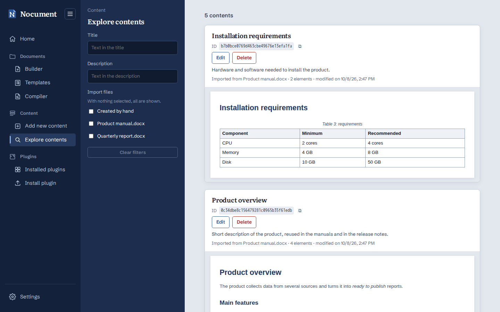

# Content blocks

A **ContentBlock** is a reusable block of contents: headings, paragraphs, images and tables in order, with name and description, saved in MongoDB. The code is in `src/content_blocks/`.

## Add new content



**Content → Add new content** (`/content/new`) creates a block:

- **Sidebar**: name and description of the block, the content types (heading, paragraph, image, table and **Saved content**), **Import from Word** and **Save content**.
- **Saved content**: dragging it onto the sheet, clicking it or choosing it from the **+** (*Saved content* tab of the form) opens the *Explore contents* page full screen in choice mode, with the same filters: select one or more contents (imported or created) and **Add**, the green button fixed at the bottom right, copies their elements onto the sheet at the chosen spot, in selection order and with new IDs; **Cancel** (red) or Esc cancels. The sheet does not change page, so unsaved work stays; the open block is not offered.
- **A4 sheet**: the contents of the block as they will appear in the document. They are added by dragging a type from the sidebar to the wanted spot (a line shows where it will be inserted), by clicking a type (at the end of the sheet) or with the **+** that appears between two contents (or at the top, if the sheet is empty). Each content is moved by dragging it, edited by clicking it (or with ✎, or with Enter) and deleted with 🗑.
- **Editing**: the same form as the Builder (styles, formatting, visual editor, tables also from CSV with choice and reordering of columns and rows and sorting), including the **Image** type (width in cm and alignment). The styles offered are those of the default Word template; after an import, those of the imported document.
- **Import from Word**: extracts headings, paragraphs (with style and formatting), tables with caption and images from a `.docx`/`.dotx`, grouped by top level heading: each group holds the heading and its whole section; the text before the first heading forms a group of its own and, without headings, the document is a single group. A modal shows the groups, each in a scrollable box with the preview: choose those to import and edit their names. With a single chosen group, **Open in the editor** opens it in the content creation page (name, description "Imported from <file>" and contents, with the document styles), to change it before saving it, after confirmation if the sheet has unsaved work; with several, **Import N contents** saves each as a separate content (description "Imported from <file>", in the language of the web app, and the file as `source`). Tables of contents and empty paragraphs are skipped; images in unsupported formats (e.g. EMF, WMF) are reported. Title and Subtitle count as headings and layout tables are opened (see `SectionAnalyzer`), so templates with the text in cells are split into groups by heading too.
- **Save content** creates the block (`POST`), the following saves update it (`PUT`). **New** starts again from an empty sheet.

## Explore contents



**Content → Explore contents** (`/content/explore`) lists the saved blocks, from the most recent:

- **Filter sidebar**: title and description (contained text, case insensitive; the search starts shortly after the last key) and import file, with a checkbox for *Created by hand* and one for each imported Word file: several origins can be chosen together, and with no choice all are shown. The filters are combined; **Clear filters** removes them.
- **List**: for each block title, ID (with a button to copy it), the **Edit** and **Delete** buttons, description, origin, number of elements and modification date, and a scrollable box with the contents as they appear on the sheet. Blocks are loaded 20 at a time (**Show more**).
- **Edit** opens the block in the *Add new content* page (`/content/edit/<id>`), with the same sheet and tools; **Save changes** updates it and **New** goes to a new block. **Delete** removes it from the database after confirmation.

Blocks imported before the source file (`source`) was introduced appear among the *Created by hand* ones. To take it from the description "Importato da <file>" (or "Imported from <file>"):

```bash
MONGODB_URI=mongodb://localhost:27017 python -m src.content_blocks.migrations
```

## Backend

- **Contents**: they implement `IDocumentContent` (`src/builder/content_interface.py`), the same interface the Builder uses to insert contents in documents: `NewHeading`, `NewParagraph`, `NewImage` and `WordTable`. Each content has a hexadecimal ID (`content_id`, 32 digits) and is serialized with `serialize()` in the format read by `content_from_dict`.
- **`ContentBlock`**: hexadecimal `id`, `title`, `description`, `source` (source Word file, `None` if created by hand), `contents` (ordered list), `created_at` and `updated_at`. `build(document)` creates all the contents, so a block can be inserted in a document with `DocumentBuilder.insert` like any content.
- **`ContentBlockBuilder`** (builder pattern): creates or edits a block with additions, moves and removals, validating the data like the API.

```python
block = (ContentBlockBuilder()
         .with_title("Release notes")
         .with_description("New features and fixes of the version")
         .add_heading("New features", level=1)
         .add_paragraph("<p>This version introduces <strong>the PDF export</strong>.</p>")
         .add_image(open("logo.png", "rb").read(), "logo.png", width=4)
         .add_table([["ID", "Description"], ["101", "PDF export"]], caption="Table 1: changes", header=True)
         .build())
block = ContentBlockBuilder.from_block(block).move(block.contents[3].content_id, 0).build()
```

- **Repository** (repository pattern): `IContentBlockRepository` (`get`, `search`, `list_summaries`, `count`, `sources`, `save`, `delete`); `search`, `list_summaries` and `count` accept a `ContentBlockFilter` (title, description and origin: one or more import files and/or the blocks created by hand). Three implementations:
  - `MongoContentBlockRepository`: one document per block in the `content_blocks` collection (`_id` = block ID), with indexes on `updated_at` and `source`; title and description are searched with a literal regular expression (the searched text is not interpreted). Image bytes are saved as binary. A MongoDB document cannot exceed 16 MB: larger blocks are rejected.
  - `SqliteContentBlockRepository`: one row per block in the `content_blocks` table of a SQLite file, with no database server (Python's `sqlite3`). The contents are a JSON column (images in base64) and the content types a separate column, so the lists do not read the contents; indexes on `updated_at` and `source`. Title and description are searched as literal text, case insensitive also for accented letters. Every operation opens its own connection and the file uses the WAL journal, so several threads and gunicorn workers can share it.
  - `InMemoryContentBlockRepository`: for tests, or to run the backend without saving anything.

  `src/app.py` uses MongoDB if `MONGODB_URI` is set (as in the Docker Compose files); otherwise SQLite, in the file `NOCUMENT_DATABASE` (default `instance/nocument.sqlite3`), or memory with `NOCUMENT_STORAGE=memory`. The data is not copied from one database to the other.
