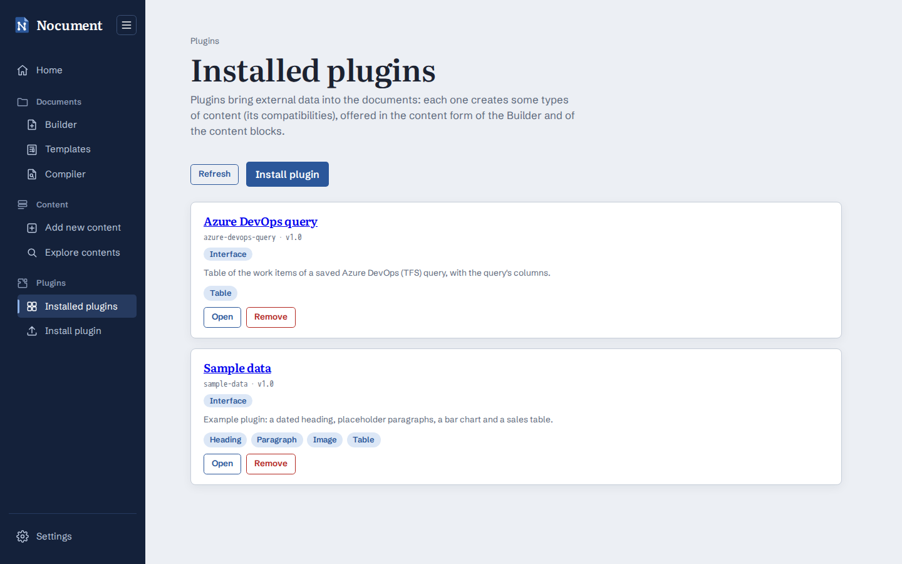
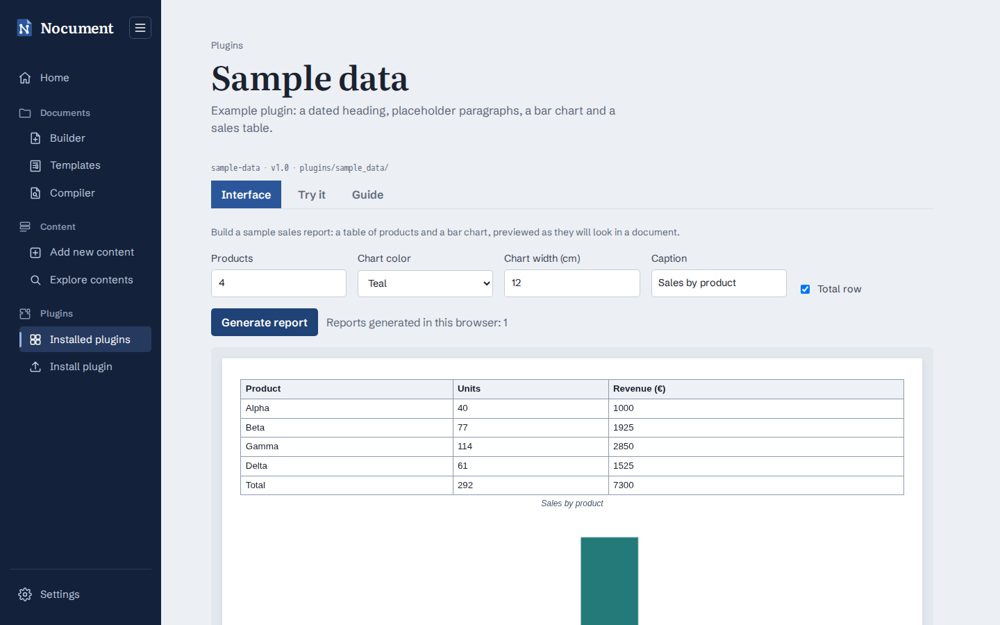
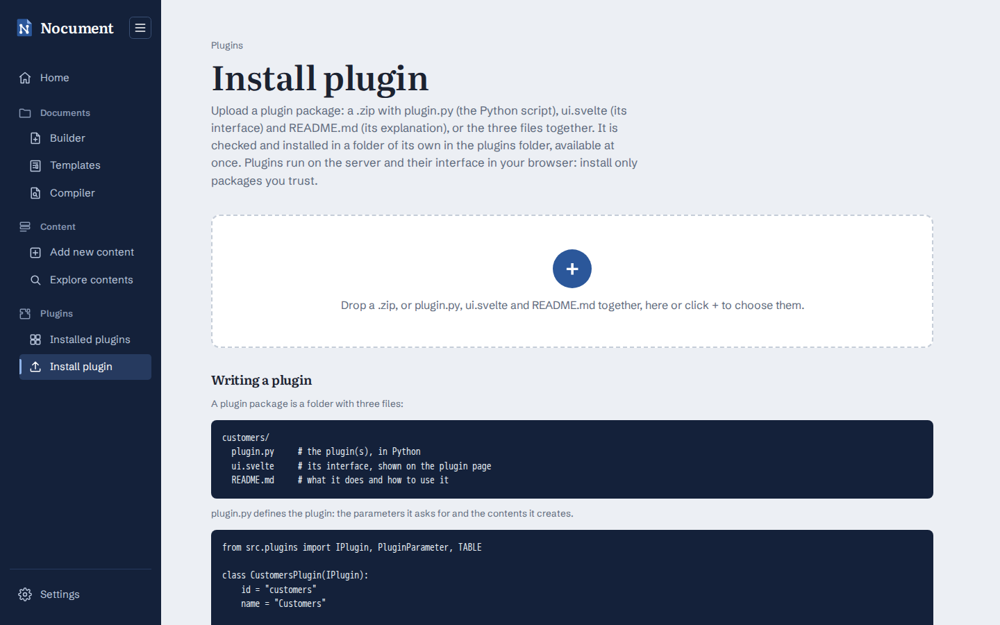

# Plugins

Plugins bring **external data** (databases, APIs, files...) into the documents: a plugin creates contents (`IDocumentContent`: headings, paragraphs, images and tables), inserted by the [Builder](Builder.md), the [content blocks](Content-Blocks.md#add-new-content) and the [Compiler](Compiler.md) like the ones written by hand.

Plugins are shipped as **packages**: a folder of `plugins/` with three files.

```
plugins/sample_data/
├── plugin.py     # the plugin(s), in Python: parameters and contents (backend)
├── ui.svelte     # its own interface, a Svelte component shown on the plugin page (browser)
└── README.md     # what it does and how to use it, shown on the plugin page
```

`plugins/sample_data/` (all the content types, presets saved in the browser) and `plugins/azure_devops_query/` (a table from an Azure DevOps query, recent queries saved in the browser) are complete examples. Loose `.py` files directly in `plugins/` (the format before packages) still work, as **Script only** plugins without interface and README.

## Using a plugin



- **Plugins** (main sidebar) lists the installed plugins, each with its own page, plus **Installed plugins** and **Install plugin**.
- **Installed plugins** (`/plugins`) shows name, id, version, description and compatibilities of each plugin (with *Interface* when its package has one), with **Open** and **Remove** (which deletes its package folder, after confirmation). Clicking the name opens the plugin page. Packages that could not be loaded are listed below with their error.
- The page of a plugin (`/plugins/<id>`) has three tabs: **Interface**, the package's own interface (opened by default), **Try it**, a form for each content type it supports with a preview of the created content, and **Guide**, the package's README.

  

- In the content form (Builder and *Add new content*), each tab shows a **From plugin** section with the plugins compatible with that type: choose the plugin, fill in its parameters and click **Load data**. The plugin's content fills the form fields, which can still be changed (style, formatting, rows...) before inserting. The section is hidden when no plugin supports the type.

## Installing a plugin



- **From the web app**: **Install plugin** (`/plugins/install`) accepts a `.zip` with `plugin.py`, `ui.svelte` and `README.md` (at its root or in a single folder) or the three files together, dropped on the area or chosen with the **+** button. The backend checks that the three files are there (and nothing else), the syntax, loads the script in a hidden staging folder and checks that it defines at least one valid plugin with an id not used by other packages; only then the package is moved to `plugins/<id of its first plugin>/`. An installed package with the same name is replaced after confirmation.
- **By hand**: copy the package folder into `plugins/` (in Docker: `docker compose cp my_plugin app:/app/plugins/`).

The folder is read again at every request listing or using the plugins: new, changed and removed packages are picked up without restarting (also by every gunicorn worker); `ui.svelte` and `README.md` are read when the page asks for them. Names starting with `_` or `.` are skipped, so they can hold helpers shared by several plugins.

> Plugins run with the same permissions as the backend: installing one from the web app means running the uploaded Python code on the server. The web app has no authentication, so on a server reachable by others set `NOCUMENT_PLUGIN_UPLOAD=false` and copy the plugins by hand. A plugin can only import the standard library and the packages installed in the backend (`requirements.txt`).

To write your own plugin, see [Writing plugins](Writing-Plugins.md).
