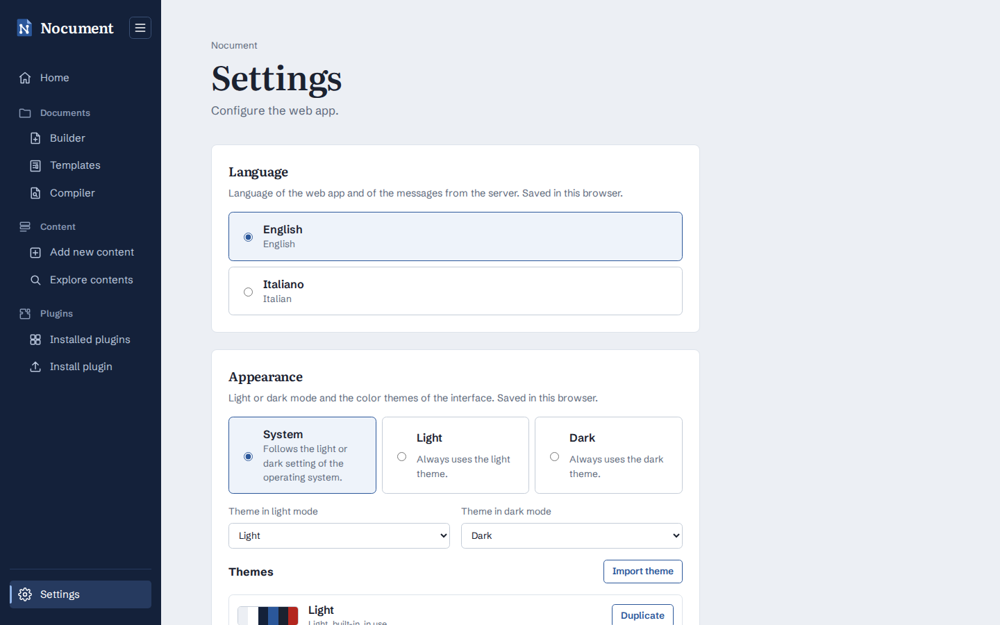

# Settings

**Settings** (`/settings`), at the bottom of the main sidebar, configures the web app. Each setting is a section of the page:

| Setting | Saved | Effect |
| ------- | ----- | ------ |
| **Language** | in the browser (`localStorage`), per user | Language of the interface and of the messages from the server (English or Italian; English by default). Applied at once. |
| **Appearance** | in the browser (`localStorage`), per user | **Mode** *System* (follows the operating system), *Light* or *Dark*, and the theme used in each mode. The built-in themes *Light* and *Dark* can be duplicated into custom themes, whose every color (about 60, grouped: surfaces, text, accent, status, sidebars, Builder graph, document paper, keyword highlights, file buttons) is chosen with a color picker or a hexadecimal value and reset one by one; while the editor is open the whole web app shows the theme being edited. Custom themes can be exported and imported as JSON. |
| **Version** | read-only | Git commit (short hash, full on hover, and date) of the **web app**, set when it was built (`web/vite.config.js`), and of the **server** (`/api/version`, `src/version.py`). Both come from `NOCUMENT_COMMIT`/`NOCUMENT_COMMIT_DATE` when set, otherwise from git (with `safe.directory`, so a mounted repository works in a container). A warning appears when the two differ (e.g. a frontend not rebuilt). |
| **PDF renderer** | on the server (`instance/settings.json`), for all users | Program that converts Word documents to PDF (see [PDF renderers](PDF-Renderers.md)). Only renderers available on the server can be chosen. |
| **Environment variables** | read-only, from the environment of the backend | All the variables of `.env.example`, grouped by section, each marked **Set** (with its value and the default) or **Default** (with the value used). *Show only the set variables* hides the others. Secret values (`AZURE_DEVOPS_TOKEN`) are never sent and passwords in URIs are masked. |

The server settings are read and written with `GET`/`PUT /api/settings` (`src/settings.py`). They are saved in `instance/settings.json` in the project root, or in the file given by `NOCUMENT_SETTINGS`; in Docker the `instance` folder is a volume. **Look**: the built-in themes use the Microsoft Word blue (`#2B579A`) as accent, with a navy navigation pane and the highlighter yellow for the current/active marks. Titles are set in Literata (a serif drawn for long reading) and the interface in Schibsted Grotesk; both are bundled with the frontend (`@fontsource-variable/*`, imported in `web/src/main.js`), so they work without internet access. Home opens with a document page (ruler, letterhead and the title and subtitle with their style names in the margin, as in Word's style area).

**Themes** (`web/src/theme.js`): every color of `app.css` is a CSS variable (`var(--accent)`, `var(--surface)`, ...) set on the root element from the active theme; shadows, the modal backdrop and translucent tints are mixed from them with `color-mix`. The A4 sheet maps the interface tokens to the *paper* ones, so it stays readable (light paper) in dark themes. To add a color, add the token to `TOKEN_GROUPS` with its value in the light and dark built-in colors, its label in `settings.appearance.tokens` in `locales/` and use `var(--<token>)` in the CSS; custom themes saved before get it from their base.

To add a setting, add its default to `DEFAULTS` in `src/settings.py`, handle it in `update_settings` (`src/app.py`) and add a section to `web/src/pages/Settings.svelte`. The environment variables shown are listed in `ENVIRONMENT_VARIABLES` (`src/settings.py`), with their descriptions in `settings.environment.variables` in `locales/`: keep them in sync with `.env.example`.
