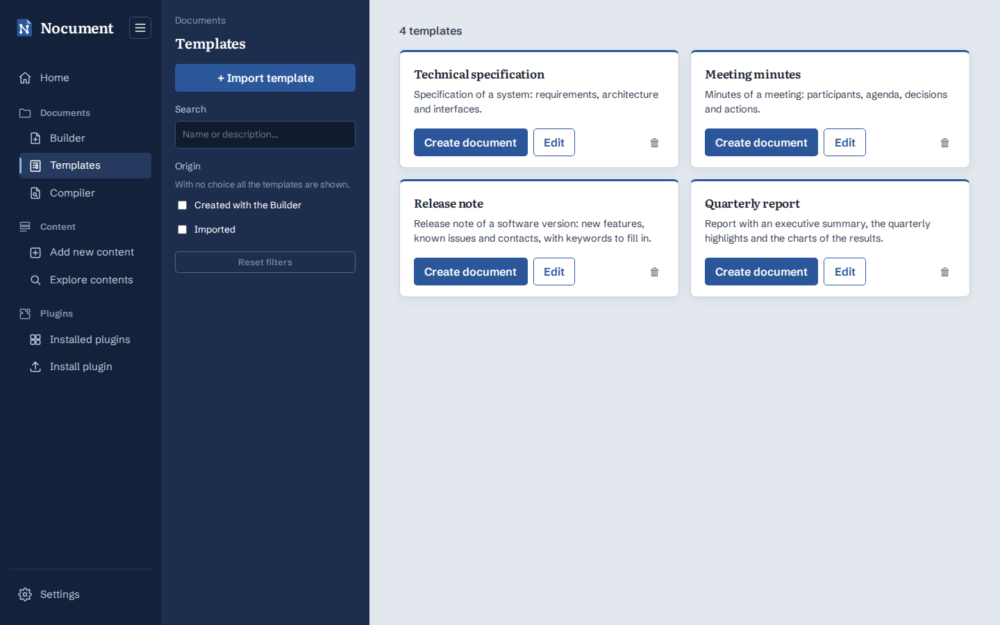

# Templates

A template is a Word document saved in the database (`src/templates/`): its structure, the graph of the Builder, holds the preallocated nodes (headings, paragraphs, tables, ...) the documents created from it start with. Each template has a name, a description, a version, its origin (*Created with the Builder* or *Imported*) and the name of the Word file it comes from.

**Documents → Templates** (`/documents/templates`) has the same layout as *Explore contents*:

- the sidebar has **Import template** (a modal with the Word file, `.docx` or `.dotx`, and the name, description and version; the name defaults to the file name), the **Search** field (text in the name or in the description, case insensitive) and the **Origin** filter; **Reset filters** clears them;
- the templates are a grid of cards, from the most recently saved, with only the name and the description (version and origin in the tooltip). **Create document** opens a new document from the template in the Builder (after confirmation if the Builder already has a document open, which is replaced); **Edit** opens the template itself in the Builder (see below); 🗑 deletes the template after confirmation. **Show more** loads the next ones.

While editing a template, the Builder sidebar shows *Editing template: <name>* and the button becomes **Save template**: its modal, prefilled with the name, description and version of the template, has **Save changes** (updates the template with the document as it is now and the new information, `PUT /api/templates/<id>`) and **Save as new template** (keeps the original and creates another template, which the Builder then goes on editing). The template being edited is kept in the Builder session, so it survives a reload; **New document**, opening a file and creating a document from a template end the editing.

Templates are saved like the content blocks: in MongoDB (collection `document_templates`, the Word file as binary, 16 MB at most) with `MONGODB_URI`, otherwise in the same SQLite file (table `document_templates`), or in memory with `NOCUMENT_STORAGE=memory`.
